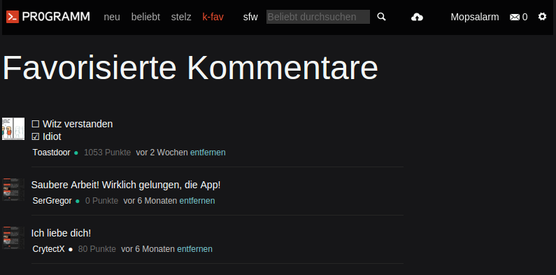

# Kommentare favorisieren

Mit diesem Userscript kannst du Kommentare favorisieren und dir die Liste
deiner favorisierten Kommentare angucken. Das Skript synchronisiert die
Liste der Kommentare mithilfe eines Hashes deiner im pr0gramm angegebenen
E-Mail-Addresse. Durch die Verwendung eines Hashwertes kann **nicht** zugeordnet
werden, welcher User einen Kommentar favorisiert hat - es ist somit sicher.

Das ganze ist aktuell bereits in der aktuellen Version meiner [pr0gramm-App](https://mopsalarm.github.io/Pr0) zu finden. Die Favoriten sind somit zwischen Browser und App synchronisiert!

## Installation

Das Userscript ist hier zu finden: https://mopsalarm.github.io/pr0gramm-comments-userscript/pr0gramm-comments.user.js.

Du benötigst ein UserScript Addon für deinen Browser.
* **Chrome**: [Tampermonkey](https://chrome.google.com/webstore/detail/tampermonkey/dhdgffkkebhmkfjojejmpbldmpobfkfo?hl=de)
* **Firefox**: [Greasemonkey](https://addons.mozilla.org/en-us/firefox/addon/greasemonkey/)
* **Opera**: [Violent monkey](https://addons.opera.com/en/extensions/details/violent-monkey/)

Hast du die Erweiterung installiert, kannst du einfach den obrigen Link zum [UserScript](https://mopsalarm.github.io/pr0gramm-comments-userscript/pr0gramm-comments.user.js) anklicken.

## Screenshot

